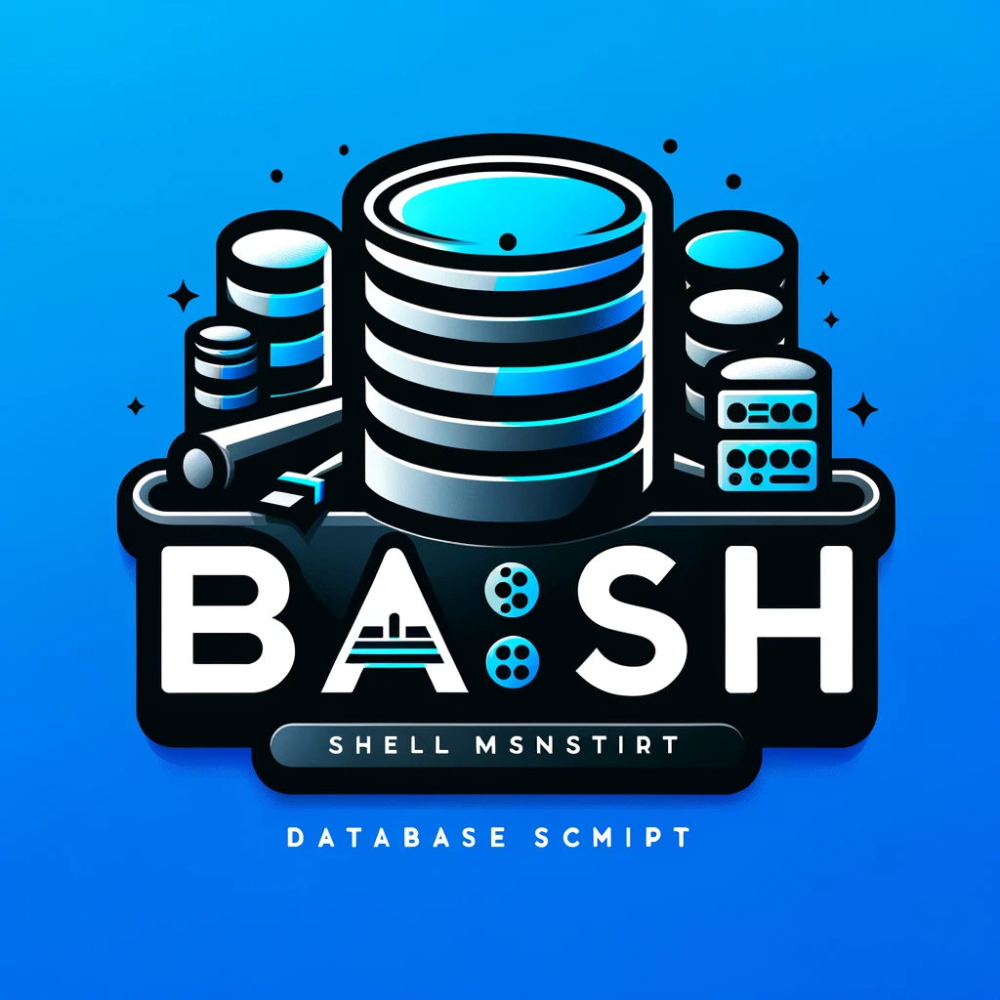

# Bash Shell Script Database Management System (DBMS)

<p align="center">
  
</p>

## Overview

This project implements a simple Database Management System (DBMS) using Bash scripting. The system allows users to perform basic database operations, such as creating databases and tables, inserting, selecting, updating, and deleting records, through a Command-Line Interface (CLI). Each database is represented as a directory, and each table is represented as a file within its respective database directory.

## Features

- **Main Menu:**

  - Create Database
  - List Databases
  - Connect to Database
  - Drop Database
  - Exit Program

- **Database Menu (After Connecting to a Database):**
  - Create Table: Define a table schema by specifying column names and data types (e.g., `int`, `string`, `boolean`, `double`).
  - List Tables: List all tables within the connected database.
  - Drop Table: Remove a table from the database.
  - Insert into Table: Add new records to a table while checking for data type validity.
  - Select From Table: Display all records in a table.
  - Delete From Table: Delete records from a table based on a specified condition.
  - Update Table: Update existing records based on specified conditions.
  - Disconnect: Return to the Main Menu.

## Getting Started

### Prerequisites

- A Unix-like operating system (e.g., Linux, macOS)
- Bash shell

### Installation

1. **Clone the Repository:**

   ```bash
   git clone https://github.com/AsmHanSalah/Bash-Shell-Script-Database-Management-System/
   cd Bash-Shell-Script-Database-Management-System
   ```

2. **Make the Script Executable:**

   ```bash
   chmod +x App.sh
   ```

3. **Run the Script:**

   ```bash
   ./App.sh
   ```

## Usage

### Main Menu Operations

1. **Create Database:**

   - Select option `1` from the Main Menu.
   - Enter a unique name for the database.
   - The database will be created as a directory.

2. **List Databases:**

   - Select option `2` from the Main Menu.
   - View the list of available databases.

3. **Connect to Database:**

   - Select option `3` from the Main Menu.
   - Enter the name of an existing database to connect to it.

4. **Drop Database:**

   - Select option `4` from the Main Menu.
   - Enter the name of the database to drop.
   - The database directory and its contents will be deleted.

5. **Exit Program:**
   - Select option `5` to exit the application.

### Database Menu Operations

1. **Create Table:**

   - Select option `1` from the Database Menu.
   - Enter a table name, columns with data types, and a primary key.
   - Example input: `id:int,name:string,age:int,is_male:boolean,height:double`

2. **List Tables:**

   - Select option `2` from the Database Menu to list all tables in the connected database.

3. **Drop Table:**

   - Select option `3` from the Database Menu.
   - Enter the name of the table to drop.
   - The table file and its metadata will be deleted.

4. **Insert into Table:**

   - Select option `4` from the Database Menu.
   - Enter the values for each column as prompted, matching the defined data types.

5. **Select From Table:**

   - Select option `5` from the Database Menu to display all records in a table.

6. **Delete From Table:**

   - Select option `6` from the Database Menu.
   - Enter a condition (e.g., `column=value`) to delete matching records.

7. **Update Table:**

   - Select option `7` from the Database Menu.
   - Enter a condition (e.g., `column=value`) to identify records to update.
   - Specify updates in the form `column=new_value`.

8. **Disconnect:**
   - Select option `8` to return to the Main Menu.

## Error Handling and Validation

- The system validates input data types during insert and update operations.
- The primary key is enforced to ensure unique values for each record.
- Error messages are displayed for invalid operations, such as trying to connect to a non-existent database or inserting incorrect data types.

## Notes

- This project is a simplified DBMS implemented for educational purposes and does not support advanced database features like transactions, indexing, or multi-user concurrency.
- It is designed to demonstrate basic database operations and file handling using Bash scripting.

## Contributing

Contributions are welcome! If you have suggestions for improvements or new features, feel free to create an issue or submit a pull request.

## License

This project is licensed under the MIT License. See the [LICENSE](LICENSE) file for details.

## Acknowledgements

- This project was inspired by the desire to explore basic database concepts using simple and accessible tools like Bash scripting.
- Thanks to everyone who provided feedback and suggestions during development.
